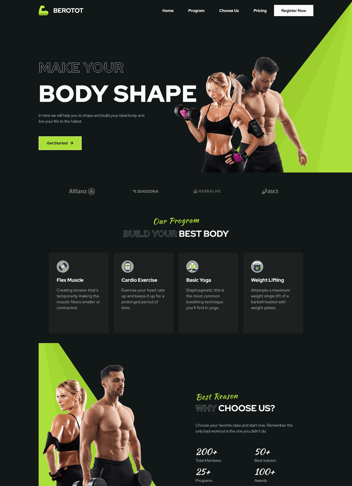
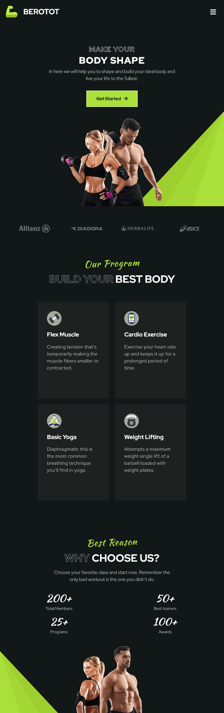
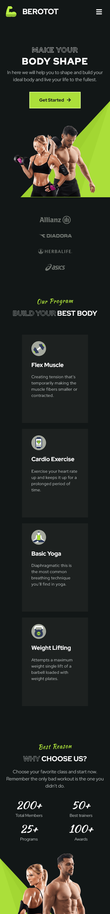

# Gym Responsive Website - Web Design Project

< gif >

[](https://br.wordpress.org/)
[](https://elementor.com/)

---
**Disponível em | _Avaliable in_: Português - BR | _English_**

Este projeto consiste no layout de um site fictício para uma rede de academias. A construção do layout é ensinada no canal do YouTube do [Bedimcode](https://www.youtube.com/@Bedimcode) ([Acesse o tutorial completo](https://www.youtube.com/watch?v=ddaY0rHqMxM)). Nessa ocasião, o lauout é construído usando HTML, CSS e JavaScript puros, porém eu decidi replicar o layout utilizando a plataforma [WordPress](https://wordpress.org/), em conjunto com o [Elementor](https://elementor.com/). Dessa forma, pude colocar em prática minhas habilidades com esse CMS e, com o auxílio de alguns plugins, tentar replicar da maneira mais fiel possível.

*This project consists of the layout of a fictitious website for a network of gyms. Layout construction is taught on [Bedimcode](https://www.youtube.com/@Bedimcode)'s YouTube channel ([Access the full tutorial](https://www.youtube.com/watch?v=ddaY0rHqMxM)). On this occasion, the layout is built using pure HTML, CSS and JavaScript, however I decided to replicate the layout using the [WordPress](https://wordpress.org/) platform, in conjunction with [Elementor](https://elementor.com/). That way, I was able to put my skills into practice with this CMS and, with the help of some plugins, try to replicate it as faithfully as possible.*

## Conteúdo | Content

- [Status do projeto | Project status](#status-do-projeto--project-status)
- [Layout](#layout)
- [Ferramentas utilizadas | Tools used](#ferramentas-utilizadas--tools-used)
- [Como baixar e instalar | How to download and install](#como-baixar-e-instalar--how-to-download-and-install)
- [Autor | Author](#autor--author)

## Status do projeto | Project status

Layout do projeto finalizado, com algumas funcionalidades a serem implementadas. Aberto a correções e propostas de melhoria.

*Finished project layout, with some features to be implemented. Open to corrections and suggestions for improvement.*

## Layout

Construído a partir do método *desktop-first*, o projeto é responsivo, ou seja, é adaptável aos mais variados tamanhos e resoluções de telas, conforme demonstrado a seguir.

*Built from the desktop-first method, the project is responsive, that is, it is adaptable to the most varied sizes and screen resolutions, as shown below.*



Captura de tela em 1440px | Screenshot in 1440px

---



Captura de tela em 768px | Screenshot in 768px

---



Captura de tela em 375px | Screenshot in 375px

---

Você também pode conferir a página acessando este link: [https://gym-three-green.vercel.app/](https://gym-three-green.vercel.app/).

**Observação:** Por se tratar de um projeto para fins acadêmicos, os links contidos na página não funcionarão, exceto os localizados no rodapé.

*You can also check the page by accessing this link: [https://gym-three-green.vercel.app/](https://gym-three-green.vercel.app/).*

*__Note:__ As this is a project for academic purposes, the links on the page will not work, except those located in the footer.*

## Ferramentas utilizadas | Tools used

Foram utilizadas as seguintes ferramentas para a construção desta página:

*The following tools were used to build this page:*

- [WordPress](https://wordpress.org/)
- [Elementor](https://elementor.com/)

Plugins auxiliares do WordPress:

*WordPress helper plugins:*

- O próprio **Elementor**, na sua versão gratuita | *The __Elementor__ itself, in its free version*
- **Elementor Header & Footer Builder**
- **TC Custom JavaScript**
- **MetForm**
- **Scrollbar**
- **Simply Static**

Apesar de o projeto ter sido construído no CMS, alguns códigos CSS e JavaScript foram implementados para fins de customização.

*Although the project was built on the CMS, some CSS and JavaScript codes were implemented for customization purposes.*

## Como baixar e instalar | How to download and install

**Atenção:** o código contido neste repositório é uma versão estática gerada pelo WordPress, não sendo possível sua importação no painel administrativo desse CMS.

*__Attention:__ the code contained in this repository is a static version generated by WordPress, it is not possible to import it into the administrative panel of this CMS.*

Para baixar e instalar o projeto no seu computador, siga os seguintes passos:

- Instale o editor [VS Code](https://code.visualstudio.com/) (recomendo fortemente, mas se há outro editor do seu gosto, não tem problema) e abra o projeto nele.
- **Importante:** o funcionamento do projeto não se dará pela execução direta do ```index.html``` (abrindo-o direto no navegador), mas sim por meio de sua execução em um servidor local. Se você usa o VS Code, instale a extensão [Live server](https://marketplace.visualstudio.com/items?itemName=ritwickdey.LiveServer) e execute clicando no botão "Go Live". Caso não utilize o VS Code, uma alternativa é instalar o [XAMPP](https://www.apachefriends.org/pt_br/index.html) ou usar o [Node JS](https://nodejs.org/en).
- Divirta-se!

*To download and install the project on your computer, follow these steps:*

- *Install the [VS Code](https://code.visualstudio.com/) editor (I highly recommend it, but if there's another editor you like, no problem) and open the project in it.*
- *__Important:__ the project will not work by running the ```index.html``` directly (opening it directly in the browser), but by running it on a local server. If you use VS Code, install the [Live server](https://marketplace.visualstudio.com/items?itemName=ritwickdey.LiveServer) extension and run it by clicking the "Go Live" button. If you don't use VS Code, an alternative is to install [XAMPP](https://www.apachefriends.org/pt_br/index.html) or use [Node JS](https://nodejs.org/en).*
- *Enjoy it!*

## Autor | Author

Feito com :heart: por este cara sonhador:

*Made with :heart: by this dreamy guy:*

|  **Giulliano Guimarães** |
| ---------------------------------------------------------------------------------------------------------------------------------- |
|[](https://github.com/giullianoth) [](https://www.instagram.com/giullianoth/) [](https://www.linkedin.com/in/giullianoth/) [](mailto:llthguimaraes@gmail.com) |
---